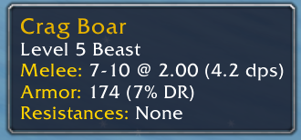
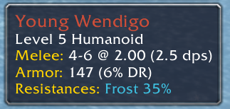

Vanilla WoW 1.12.1 and Turtle WoW addon. Displays mob stats in a human-friendly form in the game tooltip.

## Screenshots

## Version History

### v1.4 (June 6, 2025)
* Fix average resistance calculation

### v1.3 (May 11, 2024)
* Display zero armor as "None"
* Treat "?? (Boss)" level mobs as 63 lvl mobs

### v1.2 (Mar 10, 2024)
* Fix holy resistance calculation for Turtle WoW server
* Fix resistance tooltip compression algorithm

### v1.1 (Mar 9, 2024)
* Handle "skull"-level enemies properly
* Reduce visual clutter by improving resistance display strings compression algorithm
* Color the comma the same color as the text

### v1.0 (Mar 7, 2024)
* Initial release
